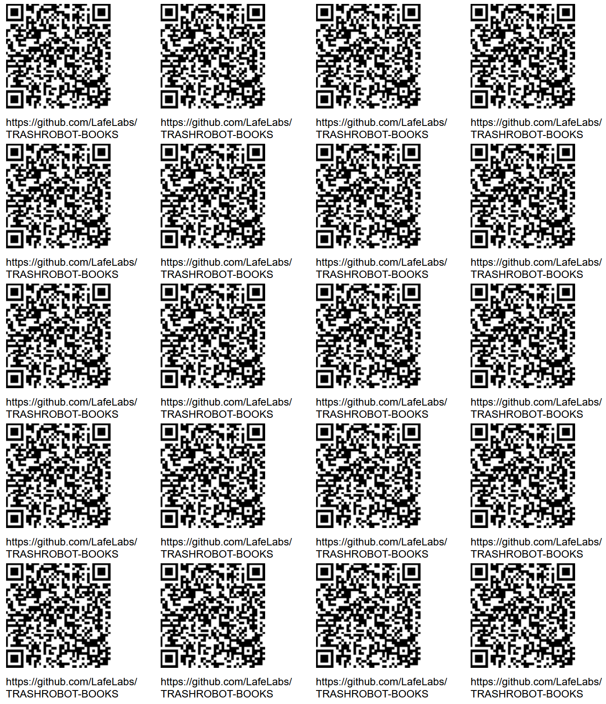

# [TRASH ROBOT BOOKS](https://github.com/LafeLabs/TRASHROBOT-BOOKS)

## [localhost/TRASHROBOT-BOOKS/](http://localhost/TRASHROBOT-BOOKS)

HOW TO REPLICATE:

1. **INSTALL  XAMPP ON YOUR COMPUTER**.  GO TO [www.apachefriends.org/](https://www.apachefriends.org/) AND DOWNLOAD THE VERSION OF XAMPP FOR YOUR MACHINE AND INSTALL IT! START THE XAMPP SERVER!
2. COPY THE TRASH MAGIC HOME PAGE AT [TRASH-MAGIC-HOME-PAGE.zip](TRASH-MAGIC-HOME-PAGE.zip) AND UNZIP THE FOLDER, AND REPLACE ALL FILES IN THE FOLDER c:\xampp\htdocs WITH THE FILES IN THE HOME PAGE FOLDER!
3. DOWNLOAD THE FULL COLLECTION OF TRASH ROBOT BOOKS AT [TRASHROBOT-BOOKS.zip](TRASHROBOT-BOOKS.zip) AND EXPAND IT INTO A FOLDER IN THE MAIN WEB FOLDER, AND NAME THE FOLDER TRASHROBOT-BOOKS
4. OPEN THE CODE EDITOR AT [http://localhost/webeditor.html](http://localhost/webeditor.html) AND ADD A HYPERLINK TO THE FOLDER [TRASHROBOT-BOOKS](TRASHROBOT-BOOKS)
5. NOW YOU CAN SEE ALL THE TRASH ROBOT BOOKS AT [http://localhost/TRASHROBOT-BOOKS/](http://localhost/TRASHROBOT-BOOKS/)

HERE IS THE HTML CODE YOU WANT TO ADD TO YOUR HOME PAGE TO POINT TO A NEW FOLDER:

```
<a href = "TRASHROBOT-BOOKS/">TRASHROBOT-BOOKS</a>
```
